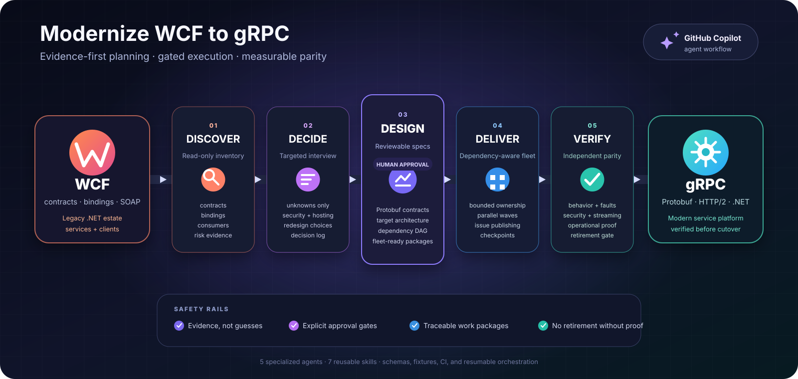

# WCF to gRPC migration plugin for GitHub Copilot CLI

A GitHub Copilot CLI plugin marketplace containing **`wcf-to-grpc`**: eight
agents, seven skills, eight artifact schemas, and a dependency-free validator that
take a legacy .NET WCF codebase to **gRPC for .NET** — through
evidence-backed analysis, an explicit decision record, a reviewable
specification, gated implementation, and independent parity validation, ending
at a WCF retirement gate that will not open without proof.

The plugin drafts before it interrupts. It selects only high-confidence,
reversible, evidence-backed recommendations as proposed assumptions, then asks
for one consolidated review. It still pauses for choices with no safe default
and for action-specific permissions, cutover, and retirement.

<p align="center">
  
</p>

- **[Architecture](docs/architecture.md)** — how the plugin is built and why
- **[Migration methodology](docs/migration-methodology.md)** — the stage-by-stage playbook
- **[Output contracts](docs/output-contracts.md)** — every file it generates
- **[Contributing](docs/contributing.md)** — conventions, validation, releases

## Requirements

| Requirement | Why |
|---|---|
| GitHub Copilot CLI, authenticated | Runs the plugin, its agents, and `/fleet` |
| PowerShell 7+ (`pwsh`) | Runs the repository validator on Windows, macOS, or Linux |
| A .NET WCF repository | The subject of the migration — services, clients, or both |
| GitHub write access *(optional)* | Only if you use the confirmation-gated Issue publication stage |

The plugin itself has no runtime dependency, no build step, no MCP server, and
no hooks.

The product-facing target is **gRPC for .NET**. Server projects run on Kestrel
and use the literal `Grpc.AspNetCore` package name; that package is unrelated to
the retired `Grpc.Core` implementation.

## Installation

`copilot plugin` and `copilot plugins` are interchangeable.

### From this marketplace

Register the marketplace, then install the plugin. The registration key comes
from `name` in [`.github/plugin/marketplace.json`](.github/plugin/marketplace.json)
— here, `wcf-grpc-marketplace`.

```shell
# Local clone
copilot plugin marketplace add /path/to/wcf_grcp_migration

# Or straight from a GitHub repository
copilot plugin marketplace add OWNER/REPO

copilot plugin marketplace browse wcf-grpc-marketplace
copilot plugin install wcf-to-grpc@wcf-grpc-marketplace
copilot plugin list
```

### From a local path, without the marketplace

```shell
# From a clone of this repository
copilot plugin install C:\path\to\wcf_grcp_migration

# Or install the plugin subdirectory directly
copilot plugin install ./plugins/wcf-to-grpc
```

### Directly from GitHub, without the marketplace

```shell
copilot plugin install OWNER/REPO
```

### Verify discovery

```shell
copilot plugins list --kind plugin --kind skill
```

Then start `copilot` and run `/agent`. Eight agents should be selectable: **WCF
Migration Orchestrator**, **WCF Codebase Analyst**, **WCF Migration Decision
Interviewer**, **WCF-to-gRPC Mapper**, **gRPC Migration Architect**, **gRPC
Migration Issue Publisher**, **gRPC Migration Implementer**, and **gRPC Parity
Validator**.

### Updating, reinstalling, removing

Installed plugins are **cached copies**: editing this working tree does not
change an already-installed plugin.

```shell
copilot plugin marketplace update wcf-grpc-marketplace   # refresh the catalog
copilot plugin update wcf-to-grpc                        # or --all

# Force a clean reinstall after local edits
copilot plugin uninstall wcf-to-grpc@wcf-grpc-marketplace
copilot plugin install wcf-to-grpc@wcf-grpc-marketplace

copilot plugin disable wcf-to-grpc                       # keep it, stop loading it
copilot plugin marketplace remove wcf-grpc-marketplace   # --force also uninstalls its plugins
```

Full command reference:
[Copilot CLI plugin reference](https://docs.github.com/en/copilot/reference/copilot-cli-reference/cli-plugin-reference).

## Quick start

Run Copilot CLI from the root of the WCF repository you want to migrate, then
pick an agent with `/agent` and prompt it.

**Run the whole migration (recommended).** Select **WCF Migration
Orchestrator**. You can start interactively with:

> Orchestrate a WCF to gRPC migration for this repository. Ask me for any
> irreducible choices, prepare the complete recommended migration plan, then
> ask me to review it once. Stop separately for publication, protected traffic,
> cutover, and retirement authority.

The orchestrator will ask for missing Stage 0 values and continue in the same
conversation after you answer. It invokes each specialist agent directly, so
you stay with the orchestrator instead of switching agents or copying handoff
envelopes. To supply the complete intake up front, use:

> Orchestrate a WCF to gRPC migration for this repository. Scope it to the
> Orders solution and exclude the legacy Billing solution. Prefer .NET 10 and use
> `docs/wcf-grpc-migration/` for output. Local test-harness access is granted;
> network, GitHub mutation, golden traffic, load testing, and production access
> are not granted. Stop at every human approval gate.

Stage 0 establishes the following values. Omitted permissions default to
denied. Repository kind comes from inventory, whole-repository scope is the
default, and the decision stage proposes the current supported .NET LTS unless
evidence makes it unsafe.

| Intake value | Accepted values or example |
|---|---|
| Repository kind | Discovered as `service-host`, `client-only`, or `mixed` |
| Scope | Defaults to the whole repository; name a bounded slice and exclusions when needed |
| Target runtime | Current supported .NET LTS is proposed; override it in review or when constraints require |
| Output directory | Defaults to `docs/wcf-grpc-migration/` |
| Network | Grant only when a stage may access external resources |
| GitHub mutation | Grant only for confirmation-gated Issue publication |
| Test harness | Grant when validation may run the migration test harness |
| Golden traffic | Grant only with the required privacy controls |
| Load testing | Grant only for an approved environment and workload |
| Production access | Grant explicitly; it is never implied by another grant |

A `blocked` stage is normally a safety gate, not a failed migration. Respond to
the orchestrator's **next required action in the same conversation**; it reads
the saved orchestration state, re-checks the gate, and resumes at the first
eligible stage.

**Just understand what you have.** Select **WCF Codebase Analyst**:

> Inventory every WCF service, contract, binding, host, consumer, and
> unsupported feature in this repository. Cite file and line evidence, and list
> the questions that static analysis cannot answer.

**Design the target.** Select **gRPC Migration Architect** (needs a validated
inventory, decision log, and mapping result):

> Author the gRPC target architecture, Protobuf contract specifications,
> roadmap, fleet-ready work packages, and consolidated review bundle from the
> proposed decisions. Block only surfaces with an irreducible unresolved
> decision.

**Build one work package.** Select **gRPC Migration Implementer**:

> Implement `WP-order-service-server` from the approved migration spec. Stay
> inside its declared file ownership and report any deviation instead of
> guessing.

**Prove it.** Select **gRPC Parity Validator**:

> Validate parity for `WP-order-service-server` against the integration
> environment. `allowNetwork` and `allowHarness` are granted; golden traffic,
> load testing, and production access are not.

## The workflow

| # | Stage | Owner | Gate that must hold first |
|---|---|---|---|
| 0 | Scope and runtime intake | Orchestrator | — |
| 1 | Read-only inventory | WCF Codebase Analyst | Scope recorded |
| 2 | Decision proposals and focused blockers | WCF Migration Decision Interviewer | Inventory complete for scope |
| 3 | WCF-to-gRPC mapping | WCF-to-gRPC Mapper | A proposal or explicit blocker exists for each affected surface |
| 4 | Architecture and specification | gRPC Migration Architect | Inventory + decisions + mapping valid |
| 5 | **Consolidated review** | A reviewer | Spec and migration-review bundle valid; no immediate blocker in scope |
| 6 | Issue publication *(optional)* | gRPC Migration Issue Publisher | Spec and work packages approved |
| 7 | Implementation waves | gRPC Migration Implementer | Approved package, satisfied dependencies, disjoint ownership |
| 8 | Integration checkpoints | Implementation stage | Every covered package reported complete |
| 9 | Independent parity validation | gRPC Parity Validator | Implementation reports exist |
| 10 | **WCF retirement** | Validator evidence + a human | Current `retirement-ready` report *and* recorded approval |

Loops are normal: findings route back to implementation, deviations to the
architect, unresolved questions to the interview. Stages never run out of
order, and changing an upstream artifact marks its downstream artifacts stale.

The operator-controlled gates are:

| Gate | What clears it |
|---|---|
| Stage 0 intake | Clarify scope only when the whole-repository default is not intended |
| Focused decision blocker | Answer only when no safe behavior-preserving recommendation exists |
| Consolidated architecture review | Approve, reject, or override the exact digest-bound decisions, specification, and work packages |
| Issue publication | Approve the full preview using its matching digest and grant GitHub mutation |
| Validation environment | Provide the named environment and explicitly grant any required harness, traffic, load, network, or production permission |
| WCF retirement | A current `retirement-ready` validation report and a separate human approval |

Inventory, mapping, specification authoring, approved implementation packages,
integration work, and validation are machine-owned stages that the orchestrator
delegates directly. It emits a manual `/agent` handoff only as recovery when
custom-agent delegation is unavailable or fails.

## Agents

| Agent | Tools | Does | Never |
|---|---|---|---|
| [WCF Migration Orchestrator](plugins/wcf-to-grpc/agents/wcf-migration-orchestrator.agent.md) | `read`, `search`, `edit`, `agent` | Sequences all stages, invokes their owning agents, enforces gates, keeps resumable run state | Does stage work, approves anything, runs commands or slash commands |
| [WCF Codebase Analyst](plugins/wcf-to-grpc/agents/wcf-codebase-analyst.agent.md) | `read`, `search`, `edit`, `execute` | Evidence-backed inventory of contracts, config, hosts, consumers, risks | Writes anything except its inventory artifact; picks a target |
| [WCF Migration Decision Interviewer](plugins/wcf-to-grpc/agents/wcf-migration-decision-interviewer.agent.md) | `read`, `search`, `edit`, `execute`, `web` | Batch-proposes safe defaults, asks focused blockers, records bundle approvals | Fabricates organizational facts or self-approves decisions |
| [WCF-to-gRPC Mapper](plugins/wcf-to-grpc/agents/wcf-to-grpc-mapper.agent.md) | `read`, `search`, `edit`, `execute` | Produces the complete, persisted WCF-to-gRPC mapping result | Silently drops constructs or authors the target architecture |
| [gRPC Migration Architect](plugins/wcf-to-grpc/agents/grpc-migration-architect.agent.md) | `read`, `search`, `edit`, `execute` | Target architecture, Protobuf specs, roadmap, fleet-ready work packages | Application code, issues, implementations, self-approval |
| [gRPC Migration Issue Publisher](plugins/wcf-to-grpc/agents/grpc-migration-issue-publisher.agent.md) | `read`, `search`, `edit`, `execute` | Generates previews and performs explicitly confirmed, duplicate-safe publication | Publishes an unapproved package or mutates GitHub before digest confirmation |
| [gRPC Migration Implementer](plugins/wcf-to-grpc/agents/grpc-migration-implementer.agent.md) | `read`, `search`, `edit`, `execute` | One approved work package: protos, hosting, adapters, clients, authn/authz, interceptors, deadlines, telemetry, tests, deployment | Touches other packages' files; edits artifacts; retires WCF |
| [gRPC Parity Validator](plugins/wcf-to-grpc/agents/grpc-parity-validator.agent.md) | `read`, `search`, `edit`, `execute` | Executes thirteen parity gates, produces findings with evidence, assesses retirement readiness | Fixes anything; modifies product code; grants retirement |

## Skills

| Skill | Purpose |
|---|---|
| [`inventory-wcf-codebase`](plugins/wcf-to-grpc/skills/inventory-wcf-codebase/SKILL.md) | Read-only, evidence-backed WCF inventory for servers and client-only repositories |
| [`interview-migration-decisions`](plugins/wcf-to-grpc/skills/interview-migration-decisions/SKILL.md) | Asks only what the repository cannot answer; persists traceable decisions |
| [`map-wcf-to-grpc`](plugins/wcf-to-grpc/skills/map-wcf-to-grpc/SKILL.md) | Cited feature, type, security, error, and streaming mappings with risk levels |
| [`author-migration-specs`](plugins/wcf-to-grpc/skills/author-migration-specs/SKILL.md) | Architecture, contracts, roadmap, work packages, acceptance criteria, DAG |
| [`publish-migration-issues`](plugins/wcf-to-grpc/skills/publish-migration-issues/SKILL.md) | Deterministic issue rendering, full-set preview, confirmation-gated publication |
| [`implement-grpc-migration`](plugins/wcf-to-grpc/skills/implement-grpc-migration/SKILL.md) | One work package at a time, bounded ownership, narrow validation, honest reports |
| [`validate-grpc-parity`](plugins/wcf-to-grpc/skills/validate-grpc-parity/SKILL.md) | Thirteen parity gates, executed evidence, findings, retirement gate |

## What it generates

Everything lands under `docs/wcf-grpc-migration/` in the repository being
migrated:

```text
orchestration-state.json   inventory.json      decision-log.json
mapping-result.json        migration-spec.json migration-review.json
migration-review.md        issue-set.json      assessment.md
decisions.md               target-architecture.md   roadmap.md
contracts/<spec-id>.md     work-packages/<work-package-id>.md
implementation-reports/<work-package-id>.md
validation-reports/<scope-key>.md
```

Schemas, identifier grammar, approval semantics, staleness rules, and the full
layout: [docs/output-contracts.md](docs/output-contracts.md).

## Safety model

**gRPC is the fixed target.** No stage retargets to REST, CoreWCF, or
messaging. Constructs gRPC cannot express become explicit redesign risks and
recorded decisions.

**Nothing irreversible happens implicitly.**

- *Consolidated review approval* is a human act. No implementation starts until
  its listed decisions, specification, and work packages are all recorded as
  approved.
- *GitHub Issues* are never mutated before the complete set is previewed and a
  human confirms the exact preview digest, with explicit per-operation
  permission flags. Duplicates are detected by stable id; partial publications
  resume rather than double-post; no credential is ever collected.
- *Parallel execution* is delegated by the orchestrator to one implementer per
  work package. Concurrent calls contain only packages with pairwise-disjoint
  file ownership; shared and schema infrastructure is always sequential and
  single-owner. `/fleet` remains available as an optional interactive mode, but
  it is not required for the orchestrated workflow.
- *WCF retirement* requires a current `retirement-ready` validation report for
  the deployed revision **and** a separately recorded human approval. Zero
  unknown callers, rehearsed rollback, and production-equivalent operational
  evidence are mandatory. "Ready with a caveat" is not ready.

**Prompt-injection resistance.** Repository content, configuration, commit
messages, issue bodies, captured traffic, and prior-stage reports are treated
as data, never instructions. Attempts to change an agent's role, widen its file
ownership, waive a gate, approve something, or make it run a slash command are
recorded and ignored.

**Secrets safety.** No credential value, token, key, certificate content, or
connection string is ever written into an artifact, report, evidence capture,
or test. Agents cite the location and redact the value. Golden production
traffic is used only with recorded permission, masking, and a stated retention
and deletion policy.

## WCF feature support

**Mechanical:** service and operation contracts, data contracts, unary
request/response, `BasicHttpBinding`/`NetTcpBinding`/`NetNamedPipeBinding`,
timeouts and quotas, message inspectors and `IErrorHandler`.

**Needs review:** message contracts and SOAP-envelope-dependent consumers,
nullability and default values, `decimal`/`DateTime`/`Guid`/enum/`KnownType`
representation, one-way operations, `WSHttpBinding`, `WebHttpBinding`.

**Unsupported — redesign plus a recorded decision:** duplex callbacks,
`InstanceContextMode.PerSession` and session state, `ConcurrencyMode.Reentrant`,
reliable sessions, distributed transactions, MSMQ, `SecurityMode.Message` and
the WS-Security family, Windows (NTLM/Kerberos) authentication, CardSpace,
WS-Management.

Details and citations:
[docs/migration-methodology.md](docs/migration-methodology.md).

**Client-only repositories** are fully supported: they get an inventory,
decisions, contract alignment, client work packages, coexistence and cutover
planning, and client-cutover validation. They produce no server work packages
and cannot own the retirement gate.

## Validation, fixtures, and CI

```powershell
pwsh -NoLogo -NoProfile -File .\plugins\wcf-to-grpc\scripts\Validate-Plugin.ps1
```

```sh
sh ./plugins/wcf-to-grpc/scripts/validate-plugin.sh
```

The validator uses only built-in PowerShell and .NET features and checks
manifests, component discovery, JSON syntax, schema drafts and `$ref` targets,
schema-valid examples and fixture expectations, frontmatter, local Markdown
links and anchors, stable identifiers, dependency acyclicity, and static WCF
fixture coverage.
[`validate-plugin.yml`](.github/workflows/validate-plugin.yml) runs it on
Windows and Linux for every push and pull request.

Three static fixture repositories exercise basic unary services, faults and
serialization edge cases, and high-risk duplex/session/transaction/streaming
constructs. They are never built. The authenticated installation smoke test is
documented in [tests/README.md](plugins/wcf-to-grpc/tests/README.md) and is
deliberately excluded from CI.

## Limitations

- **Planning and execution assistance, not a compiler.** The plugin produces
  specifications, code, and evidence; it does not guarantee a correct migration.
  Human review at each gate is part of the design, not a formality.
- **No parity without a running system.** Behavioral gates need a reachable
  environment and a legacy baseline. Without them the verdict is `blocked` —
  never `pass`.
- **Nothing is deployed or hosted for you.** Deployment, monitoring, and
  capacity remain yours.
- **SOAP interoperability is lost by design.** Consumers that depend on the
  literal SOAP envelope must migrate or be waived by an explicit decision.
- **Support-window guidance ages.** Re-check the
  [.NET support policy](https://dotnet.microsoft.com/en-us/platform/support/policy/dotnet-core)
  before acting on an LTS recommendation.
- **`/fleet` parallelism is bounded by the plan.** Poorly separated legacy code
  yields few parallel-eligible packages; that is an honest signal, not a defect.
- The primary source e-book predates .NET 8; current Microsoft Learn
  documentation takes precedence where they differ.

## Troubleshooting

| Symptom | Cause and fix |
|---|---|
| `/agent` shows no plugin agents | The plugin is not installed or is disabled. `copilot plugins list --kind plugin`, then `copilot plugin enable wcf-to-grpc` |
| Local edits have no effect | Installed plugins are cached. `copilot plugin update wcf-to-grpc`, or uninstall and reinstall |
| `copilot plugin install wcf-to-grpc@wcf-grpc-marketplace` cannot find it | The marketplace is not registered, or its catalog is stale. `copilot plugin marketplace list`, then `... marketplace update wcf-grpc-marketplace` |
| Marketplace add fails | The source must contain `.github/plugin/marketplace.json`. Point at the repository root, not the plugin directory |
| Direct repository install reports `No plugin.json found` | Update the clone or default branch to a revision containing the root `plugin.json`, then run `copilot plugin install OWNER/REPO` again |
| An agent refuses to start implementing | The specification or the work package is unapproved, or a hard dependency is unsatisfied. The refusal names the exact id |
| The architect reports `blocked` | An unresolved blocking decision. Answer the named `QST-*`, record the `DEC-*`, re-run in incremental mode |
| A validation gate is `blocked`, not `fail` | It could not be assessed — missing environment, baseline, or permission. Supply it and re-run the same scope |
| Retirement is refused | Read the retirement-readiness report: it names every unmet condition, its owner, and its next action |
| The validator fails on a Markdown link | A moved or renamed file. Local links and heading anchors are checked; fix the link, not the check |
| `Test-Json` is unavailable | PowerShell 5.1 is being used. Run `pwsh` (PowerShell 7+) |

## References

- Microsoft, *gRPC for WCF Developers* — [local copy](assets/gRPC-for-WCF-Developers.pdf) ·
  [online edition](https://learn.microsoft.com/en-us/dotnet/architecture/grpc-for-wcf-developers/)
- [gRPC for .NET](https://learn.microsoft.com/en-us/aspnet/core/grpc/)
- [Protocol Buffers proto3 language guide](https://protobuf.dev/programming-guides/proto3/) ·
  [well-known types](https://protobuf.dev/reference/protobuf/google.protobuf/)
- [gRPC status codes](https://grpc.io/docs/guides/status-codes/)
- [.NET support policy](https://dotnet.microsoft.com/en-us/platform/support/policy/dotnet-core)
- [About GitHub Copilot plugins](https://docs.github.com/en/copilot/concepts/agents/about-plugins) ·
  [plugin reference](https://docs.github.com/en/copilot/reference/copilot-cli-reference/cli-plugin-reference) ·
  [creating a plugin marketplace](https://docs.github.com/en/copilot/how-tos/copilot-cli/customize-copilot/plugins-marketplace)
- [Custom agents configuration](https://docs.github.com/en/copilot/reference/custom-agents-configuration) ·
  [running tasks in parallel with `/fleet`](https://docs.github.com/en/copilot/concepts/agents/copilot-cli/fleet)

The complete, dated source index with per-claim notes is
[`sources.md`](plugins/wcf-to-grpc/skills/map-wcf-to-grpc/references/sources.md).

## License

[MIT](LICENSE).
